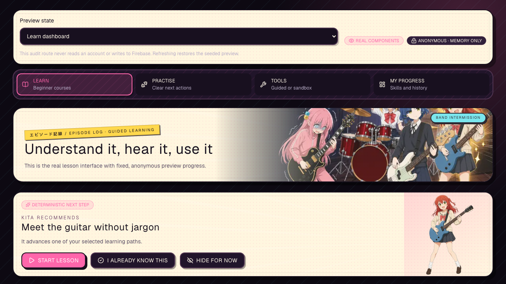
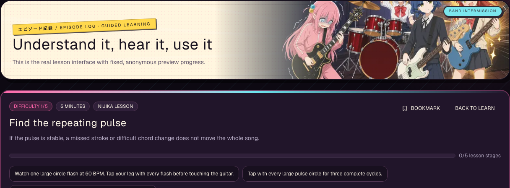
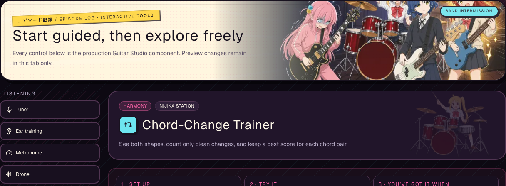
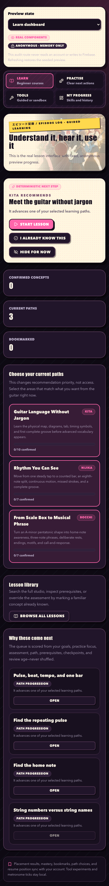
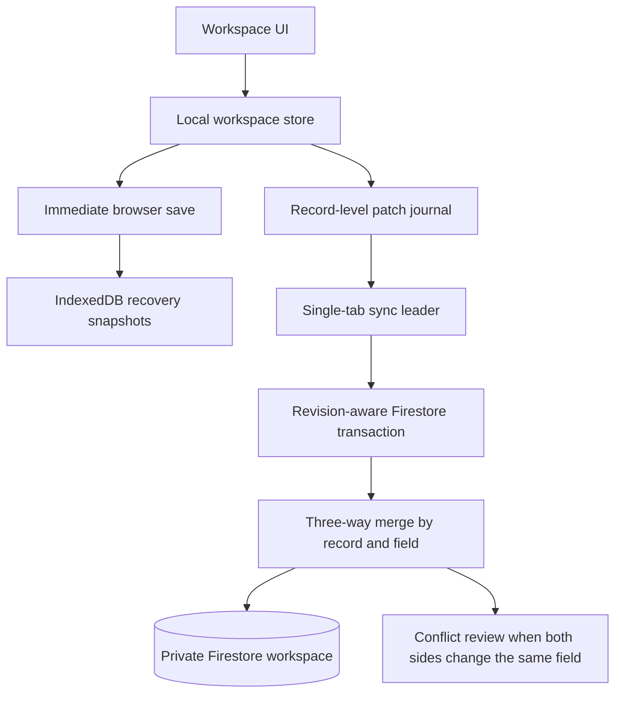

<p align="center">
  
</p>

<h1 align="center">Resolve!</h1>

<p align="center">
  <strong>Your semester, one episode at a time.</strong><br />
  A local-first semester planner, progress tracker, reflection space, and interactive guitar-learning studio wrapped in a character-driven anime interface.
</p>

<p align="center">
  <a href="https://github.com/kelvin0520lcy/resolve/actions/workflows/quality.yml"></a>
  <a href="https://github.com/kelvin0520lcy/resolve/actions/workflows/guitar-visual.yml"></a>
  <a href="https://github.com/kelvin0520lcy/resolve/actions/workflows/codeql.yml"></a>
  
</p>

## Live links

| Destination | URL | Purpose |
| --- | --- | --- |
| Resolve! | [resolve-asbp.onrender.com](https://resolve-asbp.onrender.com/) | Production application and account sign-in |
| Guitar Studio preview | [resolve-asbp.onrender.com/guitar-preview](https://resolve-asbp.onrender.com/guitar-preview) | Anonymous, memory-only tour of the real Guitar Studio components |
| Privacy Policy | [resolve-asbp.onrender.com/privacy](https://resolve-asbp.onrender.com/privacy) | Data collection, storage, retention, and user controls |
| Terms of Use | [resolve-asbp.onrender.com/terms](https://resolve-asbp.onrender.com/terms) | Service terms and fan-project notice |
| Health | [resolve-asbp.onrender.com/api/health](https://resolve-asbp.onrender.com/api/health) | Deployment and Firebase Admin readiness |
| Version | [resolve-asbp.onrender.com/api/version](https://resolve-asbp.onrender.com/api/version) | Deployed commit, schema, environment, and deployment ID |
| Source | [github.com/kelvin0520lcy/resolve](https://github.com/kelvin0520lcy/resolve) | Code, issues, Actions, and security reporting |

The production links above were verified as reachable on 28 September 2026. Resolve! is still a public beta; see [Production status](#production-status) before depending on it for irreplaceable records.

## What Resolve! is

Resolve! connects the parts of a semester that are usually scattered across a task manager, habit app, grade spreadsheet, reflection journal, career tracker, and practice notebook. A resolution becomes goals; goals can become milestones and tasks; assessments can generate preparation work; completed work feeds analytics and reflection; and the weekly plan keeps the whole system realistic.

The anime presentation is functional rather than a decorative skin. Each navigation arc groups related work around a band member's personality:

- **虹夏のリズムデスク · Nijika's Rhythm Desk** — Today, Weekly Plan, and Habits: organise the beat and keep moving.
- **ぼっちの練習室 · Bocchi's Practice Room** — Guitar and Reflections: practise privately, inspect difficulty honestly, and try again.
- **リョウの管制室 · Ryo's Control Room** — Academics and Analytics: study the system and look at the evidence.
- **喜多のスポットライト · Kita's Spotlight** — Goals, Career, and Timeline: turn intention into visible momentum.

Character dialogue is bilingual and adapted to each personality. It responds to context without changing the underlying planning rules or hiding important information behind theme elements.

## Why use it instead of a typical planner?

Resolve! is not intended to replace every calendar or project-management product. It is designed for a different problem: helping one student carry a semester-long intention through ordinary days, missed plans, assessments, habits, and skill practice.

| A typical planner often gives you… | Resolve! adds… | Why it matters |
| --- | --- | --- |
| A flat checklist | Resolutions → goals → optional milestones → required or ordinary tasks | Daily work can show what larger outcome it supports, without forcing every simple goal to have a breakdown. |
| A due date that also acts as the work date | Separate planned dates, exact time blocks, and date-only or time-zone-aware deadlines | Moving today's plan does not silently rewrite the real deadline. |
| A streak that punishes every missed day | Selected-weekday or times-per-week habits, capped at 100% when the target is met | A “twice per week” habit measures the promise you actually made. |
| Manual prioritisation | Explainable next-action ranking using deadlines, priority, available time, assessments, and at-risk goals | Recommendations say why a task surfaced and can be pinned or hidden. |
| Cloud-only saves or a vague save icon | Immediate browser saves, explicit sync states, grouped cloud writes, recovery snapshots, export, and conflict handling | Work remains responsive and recoverable while Firestore usage stays controlled. |
| Separate grade and task lists | Modules, weighted assessments, study logs, progress states, and deduplicated preparation tasks | Academic planning and execution remain connected. |
| A notes box labelled “reflection” | Structured wins, difficulties, lessons, mood, energy, a carried-forward change, and activity summaries | Reflection produces an adjustment instead of becoming an archive nobody revisits. |
| A practice timer or static chord chart | Authored learning paths, visual lessons, guitar audio, interactive tools, placement, evidence, and deterministic recommendations | Guitar practice explains what to do, shows it, lets you hear it, and records what comes next. |
| Generic encouragement | Daily, bilingual, personality-shaped prompts and character-specific page themes | The interface stays expressive without replacing useful controls or honest progress data. |

## Screenshots

The screenshots below are committed Playwright baselines. They are captured from production components at fixed desktop and Pixel 7 viewports, so they double as documentation and visual-regression evidence.

### Guitar Studio learning dashboard



### Visual lesson and chord-change trainer

<table>
  <tr>
    <td width="50%">
      
    </td>
    <td width="50%">
      
    </td>
  </tr>
  <tr>
    <td align="center"><strong>Guided lesson</strong></td>
    <td align="center"><strong>Interactive trainer</strong></td>
  </tr>
</table>

<details>
  <summary><strong>Open the full mobile Guitar Studio screenshot</strong></summary>
  <p align="center">
    
  </p>
</details>

Visit the [live anonymous preview](https://resolve-asbp.onrender.com/guitar-preview) to switch among placement, lessons, practice, tools, and progress states. Preview changes stay in memory and never read or write a user account.

## Product tour

| Area | What it does |
| --- | --- |
| **Dashboard** | Shows active resolutions, semester timing, urgent work, progress signals, and the most useful next action. |
| **Today** | Captures, edits, schedules, prioritises, starts, completes, and removes tasks; provides a focus queue and a local focus timer. |
| **Weekly Plan** | Distributes tasks and recurring events across seven days, shows capacity, and distinguishes an ordinary move from a genuine deferral. |
| **Habits** | Supports selected weekdays or a frequency such as twice per week, multiple measurement types, notes, editing, and target-aware consistency. |
| **Guitar Studio** | Offers placement, authored courses, visual lesson stages, bookmarks, practice recommendations, a fretboard, chord diagrams, tuner, metronome, rhythm, picking, ear-training, harmony, and improvisation tools. |
| **Reflections** | Records daily through semester reviews, safeguards drafts locally, summarises recent activity, and can carry one concrete change into a task. |
| **Academics** | Tracks modules, credit load, study time, target and estimated grades, weighted assessments, progress, submission, scores, and preparation tasks. |
| **Analytics** | Calculates capacity, completion, deferral, habit, goal, and practice patterns from canonical workspace records and links findings back to action. |
| **Goals** | Manages multiple semester resolutions and measurable goals; optional milestones can auto-complete from required tasks or remain manual. |
| **Career** | Tracks algorithm practice and job applications from saved through offer or closed, including the next action and its deadline. |
| **Timeline** | Combines semester dates and derived deadlines without changing the source records or losing date-only meaning. |
| **Settings** | Controls semester dates, time zone, daily capacity, recommendations, sync, import/export, archives, recovery copies, workspace reset, and account deletion. |

### Quick Capture syntax

Quick Capture turns one line into a previewed task. Recognised cues can appear in any order and are removed from the title only after the preview shows what Resolve! understood.

```text
Review calculus tomorrow 45m high priority #academics
Submit portfolio due 2026-08-15 90m #career
Practice chord changes today 20m #guitar
```

Supported cues are `today` or `tomorrow`, `due YYYY-MM-DD`, a duration from 5–720 minutes, `low|medium|high priority`, and a supported `#category`. With no cues, Resolve! creates a medium-priority Personal task in the backlog.

## Guitar Studio in more detail

Guitar Studio is a learning system inside the planner, not a collection of disconnected widgets.

- A placement assessment and “already know this” controls prevent forced repetition.
- Authored course maps expose prerequisites and explain why a lesson is recommended.
- Lesson stages move through explanation, visualisation, listening, guided action, checkpoints, application, and review.
- Practice recommendations are deterministic: the same learning state produces the same next step instead of a random shuffle.
- Interactive tools cover tuning, rhythm, picking, fretboard knowledge, chord changes, ear training, harmony, and improvisation.
- Audio is generated as guitar-oriented Web Audio rather than piano samples. Microphone tuner input is permission-gated, processed in the browser, and not recorded or uploaded.
- Evidence, bookmarks, mastery, path choices, and resume position sync with the account; temporary tool experiments and metronome ticks remain local.

## Data and sync design

Resolve! uses one canonical workspace model. Pages derive views such as deadlines and analytics instead of creating duplicate records that can drift apart.



Key behaviours:

- The browser copy updates immediately; navigation does not wait for the network.
- Rapid changes are debounced and coalesced instead of producing a write per keystroke.
- Web Locks elect one cloud-sync tab where available; an expiring `BroadcastChannel`/storage lease provides a fallback.
- Firestore revisions reject stale writes. Record-level patches merge independent edits and preserve explicit deletions.
- Date-only deadlines remain date-only. They are never silently converted to midnight in an arbitrary time zone.
- Pre-migration and pre-import recovery copies are validated before the active workspace is replaced.
- Workspace-size states warn before Firestore's document ceiling; Resolve! offers export and semester archive controls rather than deleting data silently.
- Settings exposes local, pending, syncing, synced, offline, conflict, and error states instead of presenting an ambiguous “saved” label.

Signed-in data is stored under the owner's Firebase account. The app does not use a billable live Firestore listener for every page view; sync checks are coordinated and cached, while transaction reads are reserved for coalesced cloud flushes and explicit checks.

## Privacy and security

- Email/password and Google sign-in use Firebase Authentication; email/password accounts must verify their address before workspace access.
- The production client supports Firebase App Check through reCAPTCHA Enterprise; enforcement is enabled only after monitoring legitimate traffic.
- Firestore rules enforce owner access, sequential workspace revisions, payload limits, verification, and account-deletion tombstones.
- Account deletion uses a server-only Firebase Admin credential, recursively removes account data, and temporarily blocks stale authenticated sessions from recreating it.
- Local recovery, JSON export, selective export, archive, workspace reset, and permanent account deletion are available in Settings.
- Operational logging accepts a small metadata allowlist and excludes workspace text, reflections, credentials, and tokens.
- Resolve! does not currently use advertising trackers or sell personal information.
- Dependency review, CodeQL, Dependabot, rule-emulator tests, production-mode browser tests, and deployed smoke checks support the release process.

Read the full [Privacy Policy](https://resolve-asbp.onrender.com/privacy), [Terms of Use](https://resolve-asbp.onrender.com/terms), [security policy](SECURITY.md), and [production operations runbook](docs/production-operations.md).

## Technology

| Layer | Main technologies |
| --- | --- |
| Application | Next.js 16 App Router, React 19, TypeScript |
| Interface | Tailwind CSS 4, Framer Motion, Lucide, Recharts |
| Forms and validation | React Hook Form, Zod |
| Authentication and data | Firebase Authentication, Firestore, App Check, Firebase Admin |
| Local resilience | `localStorage`, IndexedDB recovery snapshots, Web Locks, BroadcastChannel |
| Tests | Vitest, Testing Library, Firebase Rules Unit Testing, Playwright |
| Hosting and operations | Render, health/version endpoints, GitHub Actions, CodeQL, Dependabot |

## Run locally

### Requirements

- Node.js 22
- npm (the lockfile is committed)
- Java 21 only when running the Firestore emulator rule suite
- A Firebase project for authentication and cloud sync; the interface can run without Firebase in browser-only preview mode

### Setup

```bash
git clone https://github.com/kelvin0520lcy/resolve.git
cd resolve
npm ci
cp .env.example .env.local
# Fill in the Firebase values in .env.local
npm run dev
```

Open [http://localhost:3000](http://localhost:3000). To inspect the anonymous Guitar Studio audit route locally, keep `ENABLE_GUITAR_PREVIEW=true` and open [http://localhost:3000/guitar-preview](http://localhost:3000/guitar-preview).

Never commit `.env.local`, service-account JSON, App Check debug tokens, ID tokens, or other credentials.

## Environment variables

| Variable | Visibility | Required for | Notes |
| --- | --- | --- | --- |
| `NEXT_PUBLIC_FIREBASE_API_KEY` | Browser | Cloud accounts | Firebase web app configuration |
| `NEXT_PUBLIC_FIREBASE_AUTH_DOMAIN` | Browser | Authentication | Add the deployed hostname to Firebase authorised domains |
| `NEXT_PUBLIC_FIREBASE_PROJECT_ID` | Browser | Firestore and Auth | Must match the Admin project |
| `NEXT_PUBLIC_FIREBASE_MESSAGING_SENDER_ID` | Browser | Firebase web app | Supplied by Firebase Console |
| `NEXT_PUBLIC_FIREBASE_APP_ID` | Browser | Firebase web app | Supplied by Firebase Console |
| `NEXT_PUBLIC_FIREBASE_APP_CHECK_SITE_KEY` | Browser | Production App Check | reCAPTCHA Enterprise site key; monitor before enforcing |
| `FIREBASE_SERVICE_ACCOUNT_JSON` | **Server only** | Trusted account deletion and health | Paste the complete JSON as one secret; never prefix it with `NEXT_PUBLIC_` |
| `FIREBASE_ADMIN_PROJECT_ID` | Server only | Admin diagnostics | Explicit Firebase Admin project ID |
| `BUILD_TIMESTAMP` | Server only, optional | Version diagnostics | Render supplies the commit separately through `RENDER_GIT_COMMIT` |
| `ENABLE_GUITAR_PREVIEW` | Server only | Audit route | Leave disabled unless the anonymous preview is intentionally public |

Use [.env.example](.env.example) as the canonical template.

## Firebase setup

1. Create a project in the [Firebase Console](https://console.firebase.google.com/).
2. Enable Email/Password and Google Authentication.
3. Create Firestore and register the web app.
4. Create a reCAPTCHA Enterprise key, register the app with Firebase App Check, and deploy in monitoring mode before enabling enforcement.
5. Create a Firebase service account and store the complete JSON in `FIREBASE_SERVICE_ACCOUNT_JSON` on the server only.
6. Install/authenticate the Firebase CLI, select the intended project, and deploy the rules and index exemptions:

```bash
firebase deploy --only firestore:rules,firestore:indexes
```

The index exemptions keep the large workspace map and server timestamp out of indexes because Resolve! reads a workspace by document ID and does not query those fields. Follow [docs/production-operations.md](docs/production-operations.md) for App Check rollout, deletion protection, backups, alerts, quota monitoring, and restore drills.

## Commands and quality gates

| Command | Purpose |
| --- | --- |
| `npm run dev` | Start the local Next.js development server |
| `npm run typecheck` | Generate Next.js route types and run TypeScript checks |
| `npm run lint` | Run ESLint |
| `npm test` | Run the Vitest unit and component suites |
| `npm run test:rules` | Run Firestore security-rule tests in the emulator; requires Java 21 |
| `npm run build` | Create the production build |
| `npm run test:e2e` | Run Playwright browser tests against the configured server |
| `npm run test:e2e:production` | Build and exercise the app in production mode without Firebase credentials |
| `npm run test:e2e:guitar-visual` | Compare Guitar Studio desktop/mobile screenshots in the pinned rendering environment |
| `npm run test:e2e:deployed` | Smoke-test a deployed URL, public routes, health, version, and Guitar preview |

The main Quality workflow runs type checking, linting, unit/component tests, Firestore rule tests, a production build, and browser workflows. Guitar visual snapshots run separately inside a digest-pinned Playwright container with serial rendering, font/image readiness checks, and deterministic seeded state.

## Deploy to Render

1. Connect this repository to a Render web service.
2. Use `npm ci && npm run build` as the build command.
3. Use `npm run start` as the start command.
4. Add every production variable from [.env.example](.env.example) in Render's Environment panel. Keep Admin credentials server-only.
5. Configure `/api/health` as the Render health-check path.
6. Deploy Firestore rules and indexes separately through the Firebase CLI.
7. After deployment, confirm `/api/version` reports the intended commit and `/api/health` returns HTTP 200.
8. Run the **Deployed smoke** GitHub workflow with the production base URL.

Render supplies `RENDER_GIT_COMMIT`; Resolve! exposes it through `/api/version` and shows deployment information in Settings for diagnosis.

## Project structure

```text
src/
├── app/
│   ├── (auth)/                 # Login, signup, verification, password reset
│   ├── (dashboard)/            # Account-gated product pages
│   ├── api/                    # Health, version, operational events, deletion
│   ├── guitar-preview/         # Anonymous deterministic Studio audit route
│   ├── privacy/ and terms/     # Public legal pages
│   └── page.tsx                # Public landing page
├── components/
│   ├── character/              # Contextual companion presentation
│   ├── layout/                 # Sidebar, mobile nav, command palette, capture
│   ├── legal/                  # Shared legal-page structure
│   ├── ui/                     # Reusable interface primitives
│   └── workspace/              # Recovery and workspace-level UI
├── contexts/                   # Stable provider entry points
├── features/
│   ├── guitar-learning/        # Courses, tools, visuals, audio, learning state
│   └── workspace/              # Actions, analytics, migrations, sync, recovery
├── lib/
│   ├── character/              # Dialogue and expression rules
│   ├── constants/              # Categories and navigation arcs
│   └── firebase/               # Client, Admin, App Check, workspace I/O
└── types/                      # Canonical product records

e2e/                            # Workflow and visual browser tests
tests/                          # Unit, component, integration, and rule tests
docs/                           # Operations, release, and illustration guidance
firestore.rules                 # Owner, revision, verification, deletion rules
firestore.indexes.json          # Workspace index exemptions
```

## Contributing and reporting problems

Before proposing a code change, run the checks that match its risk; for a general change, use the full sequence:

```bash
npm run typecheck
npm run lint
npm test
npm run test:rules
npm run build
npm run test:e2e:production
```

- Report ordinary problems through [GitHub Issues](https://github.com/kelvin0520lcy/resolve/issues).
- Report suspected vulnerabilities privately through [GitHub Security Advisories](https://github.com/kelvin0520lcy/resolve/security/advisories/new).
- Do not place passwords, Firebase credentials, tokens, private reflections, or another person's data in an issue.
- Visual changes to Guitar Studio should include reviewed desktop and mobile baselines rather than wider screenshot tolerances.

## Production status

Resolve! is version `0.1.x` and labelled **public beta**. The repository includes production controls, but Firebase, Render, App Check, backup retention, monitoring, secret scanning, and restore drills also depend on external console configuration. The [operations runbook](docs/production-operations.md) is the release checklist and clearly separates repository controls from operator responsibilities.

Keep an independent export of important records while the service is in beta.

## Fan-project notice

Resolve! is an unofficial, non-commercial fan project. It is not affiliated with, endorsed by, or sponsored by *Bocchi the Rock!*, its publishers, animation studios, licensors, National University of Singapore, or other rights holders. Names, characters, instruments, and referenced properties belong to their respective owners. The interface and planning software are provided for personal organisation and learning; they are not academic, medical, mental-health, legal, or financial advice.
